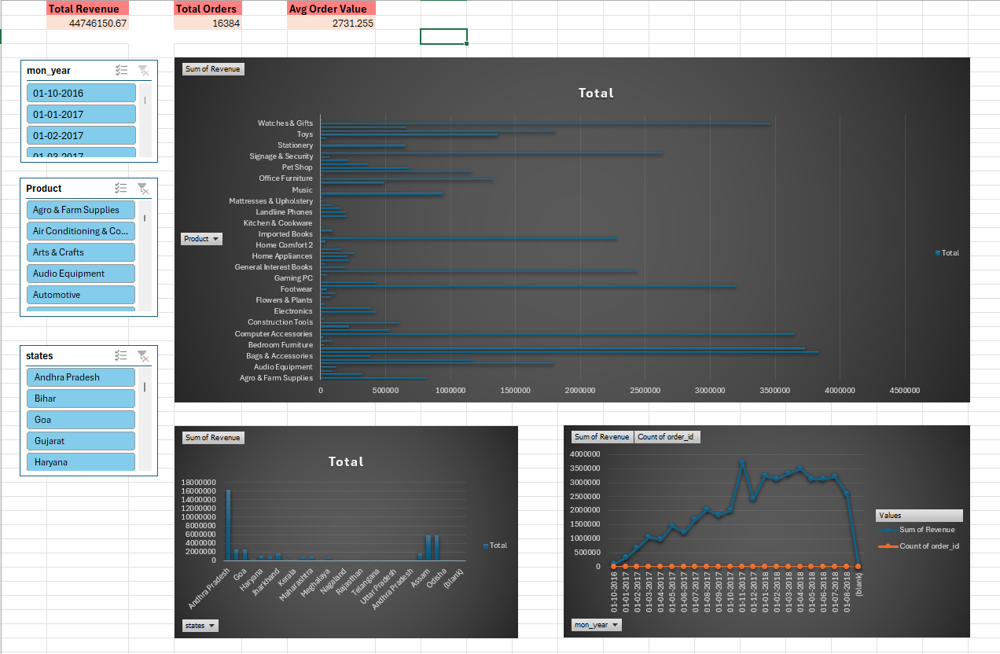
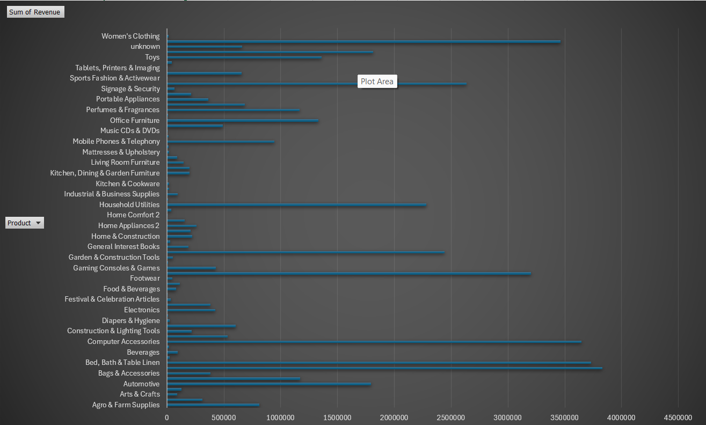
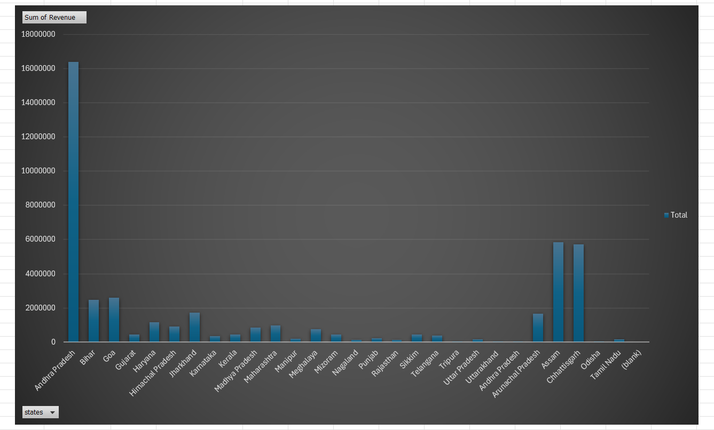

# 🛒 Indian E-Commerce Sales Analysis — Excel | MySQL

## 📌 Problem Statement
Simulated role of a Data Analyst at a Meesho/Flipkart-style platform.
Management wants to know: Which product categories drive revenue?
Which states perform best? What is the monthly order trend?

## 🛠️ Tools & Technologies
| Tool | Purpose |
|------|---------|
| Microsoft Excel | Pivot Tables, KPI cards, Dashboard, Slicers |
| MySQL | Data storage & SQL analysis |

## 📁 Project Structure
- `dataset/` — Cleaned final dataset (117K+ rows)
- `sql/` — Table creation + 4 analysis queries
- `excel/` — Excel dashboard file
- `screenshots/` — Dashboard preview images

## 📊 Dataset Overview
| Field | Value |
|-------|-------|
| Total Records | 117,328 orders |
| Total Revenue | ₹4.47 Crore |
| Time Period | 2016 – 2018 |
| Columns | order_id, states, Product, Revenue, Month, Year, order_status, review_score |

## 🔍 Key Findings
- Total Revenue: **₹4.47 Crore** across 16,384 orders 
  (filtered view — full dataset: ₹34.3Cr, 117K+ orders)
- **Watches & Gifts** and **Bedroom Furniture** are 
  top revenue-generating categories
- **Andra Pradesh & Assam** are top revenue-generating states
- Revenue peaked in **mid-2017** then stabilized through 2018
- **Bags & Accessories** and **Gaming PC** also among 
  top performing categories
- Avg Order Value: **₹2,731** per order

## 📈 Excel Dashboard Features
- 3 KPI Cards — Total Revenue, Total Orders, Avg Order Value
- Revenue by Product Category (horizontal bar chart)
- Revenue by State (horizontal bar chart)
- Monthly Revenue Trend (line chart)
- 3 Interactive Slicers — Month, State, Product

## 📸 Dashboard Preview

## 🗄️ SQL Queries
| File | Analysis |
|------|---------|
| Q1 | Top 10 products by revenue |
| Q2 | Monthly revenue trend |
| Q3 | Cancellation rate by category |
| Q4 | State performance (basic + detailed) |

## ⚙️ How to Run
1. Import `dataset/final_dataset.csv` into MySQL
   using `sql/Q0_create_table.sql`
2. Run queries Q1 → Q4 in order
3. Open `excel/Dashboard.xlsx` in Microsoft Excel
4. Use slicers to filter dashboard interactively
